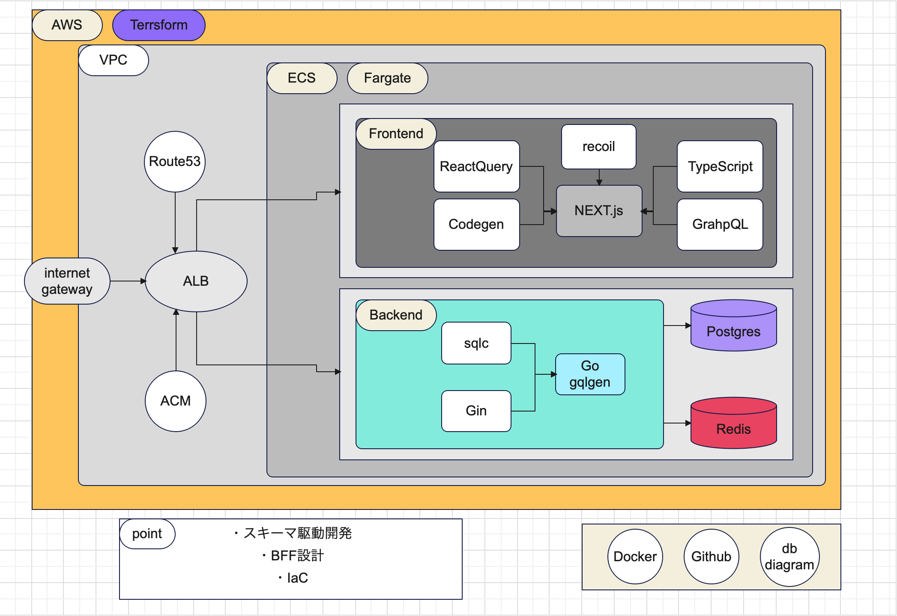

--個人開発--

<h2 align='center'> Commend-Style
<h2 align='center'> ~新たなコマンドとの出会い~

<h3>機能</h3>

・コマンド検索
・コマンド投稿
・コマンド編集
・コマンド削除
・お気に入り
・ログイン、ログアウト
・タグ機能
・投稿管理
・ソート機能

<h2 align='center'> -Structure-
<code></code>

<h2 align='center'> -Database-
<code></code>

<h2 align='center'> -Technology-

<h3>Frontend</h3>

<h3>Backend</h3>

<h3>Database</h3>

<h3>Infrastructure</h3>

